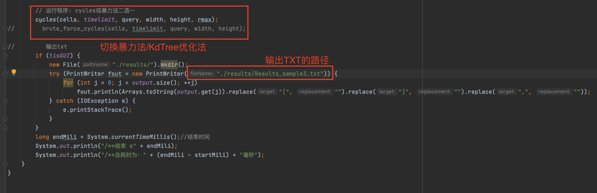

# README

***

## INTRO

该project实现了四种颜色小球的移动和变色([简单规则](./Project_requirement.pdf)下的生命游戏)。程序使用了algs4库，重写了StdDraw.java来实现GUI动画的显示，并且增加了底部状态栏，实时显示帧率变化。算法实现主要包括：Main_KdTree.java、 Cell.java、 Colors.java、 KdTree.java、 Position.java、 Rect.java 和修改过的 StdDraw.java，其中 Main_KdTree.java 是 main
函数所在的类，是整个 project 的主类。
该简介内容分为：

- 一、程序运行方式
- 二、程序结构：terminal模式、GUI模式的实现方式
- 三、性能优化（理论）：树结构介绍、树的维护
- 四、程序测试：正确性、效率性测试
- 五、实现大样本生成
- 六、困难问题解决历程  
共六个部分。

***

## 一、程序运行方式

### 运行方式一：通过IDEA

1.

<div style="text-align: center;">
    
    <br>
    <div style="color:orange; border-bottom: 1px solid #d9d9d9;
    display: inline-block;
    color: #999;
    padding: 2px;">介绍各个文件夹、文件的作用</div>
</div>

2.

<div style="text-align: center;">
    
    <br>
    <div style="color:orange; border-bottom: 1px solid #d9d9d9;
    display: inline-block;
    color: #999;
    padding: 2px;">设置程序依赖库，以便调用alg4（中的StdDraw）</div>
</div>  

3.

<div style="text-align: center;">
    
    <br>
    <div style="color:orange; border-bottom: 1px solid #d9d9d9;
    display: inline-block;
    color: #999;
    padding: 2px;">输入重定向、程序传参的设置</div>
</div>  

4.

<div style="text-align: center;">
    
    <br>
    <div style="color:orange; border-bottom: 1px solid #d9d9d9;
    display: inline-block;
    color: #999;
    padding: 2px;">通过注释 切换优化算法、暴力算法</div>
</div>

5.

<div style="text-align: center;">
    
    <br>
    <div style="color:orange; border-bottom: 1px solid #d9d9d9;
    display: inline-block;
    color: #999;
    padding: 2px;">从这里开始程序</div>
</div>

### 运行方式二：BAT集成文件

1. 在scripts文件夹下打开任意Bat文件

<div style="text-align: center;">
    
    <br>
    <div style="color:orange; border-bottom: 1px solid #d9d9d9;
    display: inline-block;
    color: #999;
    padding: 2px;">在scripts文件夹下打开任意Bat文件</div>
</div>

2. 目前情况是需要手动修改BAT中的路径、文件名，直接拖拽文件似乎不行

<div style="text-align: center;">
    
    <br>
    <div style="color:orange; border-bottom: 1px solid #d9d9d9;
    display: inline-block;
    color: #999;
    padding: 2px;">修改BAT中的路径、文件名</div>
</div>

3. 运行修改后的BAT文件，回车，结束运行

<div style="text-align: center;">

<br>
<div style="color:orange; border-bottom: 1px solid #d9d9d9;
display: inline-block;
color: #999;
padding: 2px;">运行Bat</div>
</div>

4. 得到result TXT(需手动修改相应文件名)/GUI界面

<div style="text-align: center;">

<br>
<div style="color:orange; border-bottom: 1px solid #d9d9d9;
display: inline-block;
color: #999;
padding: 2px;">得到结果</div>
</div>

<div style="text-align: center;">

<br>
<div style="color:orange; border-bottom: 1px solid #d9d9d9;
display: inline-block;
color: #999;
padding: 2px;">注意事项</div>
</div>

***

## 二、程序基本结构

## `terminal`模式的实现方式

- ### 开始

  - 运行*Main_KdTree*.java
  - terminal模式输入input (**画布大小、细胞参数、queries**)
  - 初始化`Cell`（包括**位置、半径、感知范围p、颜色**）
  - 设定时间边界`timelimit`为输入`query`的最大值
  - 运行程序：优化版（cycles）或暴力法（brute_force_cycles）二选一进入循环

- ### 优化版 (cycles) 进入循环

  for循环的次数为`timelimit*15`
  >(以1/15为单位，减少用double类型存储1/15产生的误差)

  伪代码如下：

  ````
  // 建立Kd树,放入全体细胞列表cells
  // 下面开始一轮移动
  for (int i = 0; i < cells.length; i++){
      // 计算出细胞移动时冲撞矩形的半径（包含了所有可能碰撞的细胞，缩小范围）
      // 根据细胞位置、上述半径得到冲撞矩形
      // 根据冲撞矩形找出冲突的细胞集合（包含cells[i]自身）
      // 根据上述细胞集合，移动cells[i]
  }
  
  // 下面开始一轮感知，并保存变色结果
  for (int i = 0; i < cells.length; i++) {
      // 计算细胞移动后的感知矩形半径（包含了所有cells[i]可能感知的细胞，缩小范围）
      // 根据细胞位置、感知半径计算出感知矩形
      // 找出感知矩形内可以感知的细胞的集合（包含cells[i]自身）
      // 根据感知集合得出并保存变色结果
  }
  // 一轮变色
  ````

- ### 暴力法（brute_force_cycles）进入循环

  for循环的次数为`timelimit*15`(以1/15为单位，减少误差)

  ````
  // 一轮移动(全部遍历)
  // 一轮感知，保存变色结果(全部遍历)
  // 一轮变色
  ````

- ### 循环结束

  输出queries查询的细胞状态（位置、颜色）；  
  将其保存至txt文档中，如`results/Results_sample1.txt`；

***

## `GUI`模式的实现方式

只考虑与`Terminal`模式不同之处：

- 忽视query，一直运行cycle（while true）；
- 根据输入TXT中的宽度、高度自动缩放，以适应屏幕大小；

  ```
   if (isGUI) {
       double ratio = width / height;
       int width_pixels = (int) (ratio * 670);             //换算为合适比例
       JPanel panel = StdDraw.setCanvasSize(width_pixels, 700);
       panel.setBounds(0,670,width_pixels,30);
       panel.setOpaque(true);
       status = (JLabel) panel.getComponent(0);
       panel.setVisible(true);
       // enable double buffering
       StdDraw.enableDoubleBuffering();
       StdDraw.setXscale(0, width);
       StdDraw.setYscale(-0.045*height, height);
       StdDraw.clear();
       for (int i = 0; i < cells.length; i++) {
            cells[i].draw();
       }
       StdDraw.show();
   }
  ```

- 在cycles中加入暂停时间的代码，以使得算力足够时，程序时间和真实时间同步；
- 在窗口底部添加状态栏，计算出帧率并能实时显示；
  > 每次循环的帧率用 （1/单次循环运行时间） 表示

   ```
   // 循环开始，开始计时
   Stopwatch stopwatch = new Stopwatch();
    ...
    循环代码
    ...
    if (isGUI) {
       StdDraw.clear();
       for (int k = 0; k < cells.length; k++) {
          cells[k].draw();
       }
       StdDraw.show();
       // 得到计时
       double elapsedTime = stopwatch.elapsedTime();
       // 根据运行时间调整暂停时间
       double suspend = 1000 / 15 - elapsedTime * 1000;
       // 若算力足够，则等待至满1/15s后再进入循环
       if (suspend >= 0) {
          StdDraw.pause((int) Math.abs(suspend));
       }
       double elapsedTime1 = stopwatch.elapsedTime();  //输出一个循环的总时间/每秒帧率
       status.setText(String.format("Iterations per second:  %.6f", (1 / elapsedTime1)));
       status.setOpaque(true);
       status.setBackground(Color.green);
    }
   ```

***

## 三、性能优化（理论）
>
>1. 通过Kd树优化碰撞、感知的搜索；
>2. 通过四叉树优化碰撞、感知的搜索；（实际效果不好，故采用了Kd树）
>3. 四叉树的维护，减少不必要的生成新树的过程；
>4. 关于多个query的优化：取t最大值，记录中间时间多个点的cell状态，避免多次不必要的循环；

### 1.Kd树

- *Main Idea*：类似一维情况的BST树，二维平面的KdTree的每个节点存储一个二维的坐标点，并以该点所在的横线/竖线递归地将平面分割成两个子空间；
- *描述*：  
  - 点对平面的分割方式按插入节点的个数，依次横向/纵向交替出现(根节点处任意选定一个方向)；
- 图示：

<div style="text-align: center;">
    
    <br>
    <div style="color:orange; border-bottom: 1px solid #d9d9d9;
    display: inline-block;
    color: #999;
    padding: 2px;">Kd树放入新的细胞</div>
</div>

- *实现算法*：
  - 从根节点开始插入，如果待插入节点在根节点的左边或者下边，那么就访问根节点的左子树，反之访问右子树；直到访问叶节点。
  - 不需要实现节点的删除，每次循环，根据新的细胞及其坐标新建一棵树即可。
  - Kd树的建立只考虑了细胞的坐标，如何找出cells[i]可能的移动冲突集合？考虑到每次细胞最多移动1/15距离，只需对其余细胞移动后的位置做一个大概的估计；
  - 移动冲突的矩形半径图示：
  <div style="text-align: center;">
    
    <br>
    <div style="color:orange; border-bottom: 1px solid #d9d9d9;
    display: inline-block;
    color: #999;
    padding: 2px;">冲突距离、冲突矩形图示</div>

</div>

_参考链接：[https://blog.csdn.net/weixin_31458459/article/details/114318298](https://blog.csdn.net/weixin_31458459/article/details/114318298)_

### 2.四叉树（弃用）

- *Main Idea*：根据四个`象限`大致划分`node`位置，将点的位置大致用一串数字4进制表述；
- *描述*：
  - 初始时将第一个点放入四叉树`root`,整个空间视为一个大的象限（`level` = 0）;
    将一个新点放入树后，若`level`= 0 的象限中有多个点，则将`level`= 0 的对应象限分裂成四个子象限，直到每个象限都不包含冲突点，每次分裂，象限的`level`数增加1；  
    换言之，每次每个象限有多个点时，就把聚焦范围细化，使得每个象限最后精确指向一个node或是空指针；
  - 特殊情况：如果有node在象限交界上，则把它保留在父节点上（以数组的形式储存）；
- 图示：

<div style="text-align: center;">
    
    <br>
    <div style="color:orange; border-bottom: 1px solid #d9d9d9;
    display: inline-block;
    color: #999;
    padding: 2px;">四叉树放入一个新的细胞</div>
</div>

- *实现算法*：
  - 向一个结构完好的四叉树添加一个cell，分三种情况讨论：
    - 1.cell不可细分入更小的矩形：直接加入该节点的特殊数组；
    - 2.cell可细分，插入茎节点时：转化为向下一级子节点插入cell；
    - 3.cell可细分，插入叶节点：插入后判断叶节点是否会分裂；
  - 每次insert后仍保持四叉树的结构，进而每个小象限/rectangle至只包含一个可细分cell。

_参考链接：[https://blog.csdn.net/qq276592716/article/details/45999831](https://blog.csdn.net/qq276592716/article/details/45999831)_

### 3.四叉树的维护

- *Main Idea*：每一个cycle/移动时重新建立四叉树会消耗大量资源，且会重复进行很多工作；
- 实现：
  - 对每个移动后的cell，先判断位置是否越过了原有的四叉树划分，再delete原cell，最后重新insert 新cell；
  - delete方法实现的分类讨论：
    - 去掉不可细分节点：
      - 直接去掉，不影响树的正常结构，因为影响此层是否分裂的是此层的yes（可细分细胞）个数；
    - 去掉叶节点里的cell：
      - 观察一：直接去掉之后这层永远不会为空（>=1）；
      - 观察二：去掉之后叶节点只有在与叶节点同阶只有一个点的情况下，才可能退化；
      - 树的退化的实现：
        - 将多余的空叶节点设置为null;
        - 同时将子节点的剩下点传入父的yes；
      - 注意：可能出现两个细胞，但是split 3次、4次、5次的情况，故反过来退化时也要一直回溯；

***

## 四、程序测试

1. 程序正确性验证

> i.  移动、感知、变色的简单test cases；  
> ii. 在terminal模式下可以对给定samples产出正确的结果  
> >（欲进行精确度验证，运行Test_File_Output.java即可）；
>
> iii. GUI模式下可正常显示；

2. 程序效率测试（时间复杂度）
>
> - 暴力法 与 Kd树 两种不同实现方式的效率对比

### 1.程序正确性验证

#### i. 简单Test cases（移动、感知、变色）

test文件夹下储存了简单的功能测试样例，调用GUI模式运行即可观察结果：  
（因篇幅过长，不在此处插入图片，如要查看运行结果，可到pic/test显示目录下查看图片）

1. 简单的单个细胞的移动；详见test1_move_*.txt；
2. 细胞位于边界，处于静止状态；详见test1_move_*.txt，等到细胞移动到边界即可观察结果；
3. 多个细胞（半径相似）互相阻止移动（移动冲突检测），处于静止状态；详见test2_move_against_*.txt；
4. 多个细胞（半径迥异）互相阻止移动（移动冲突检测），处于静止状态；详见test2_move_against_*.txt；
5. 细胞变色测试，初始全为红色；详见test3_mutation_color_*.txt；
6. 细胞变色测试，普通情况；详见test3_mutation_color_*.txt；

#### ii. terminal模式下，samples输出与参照对比

- 在重定向输出后，运行Main_KdTree.java，输出txt至results文件夹下；
- 通过Test_File_Output.java对比输出是否正确；

<div style="text-align: center;">
    
    <br>
    <div style="color:orange; border-bottom: 1px solid #d9d9d9;
    display: inline-block;
    color: #999;
    padding: 2px;">Output输出至TXT文档</div>
</div>

<div style="text-align: center;">
    
    <br>
    <div style="color:orange; border-bottom: 1px solid #d9d9d9;
    display: inline-block;
    color: #999;
    padding: 2px;">对比输出是否正确</div>
</div>

<div style="text-align: center;">
    
    <br>
    <div style="color:orange; border-bottom: 1px solid #d9d9d9;
    display: inline-block;
    color: #999;
    padding: 2px;">运行结果，显示输出正确</div>
</div>

#### iii. GUI模式的正确显示

<div style="text-align: center;">
    
    <br>
    <div style="color:orange; border-bottom: 1px solid #d9d9d9;
    display: inline-block;
    color: #999;
    padding: 2px;">Sample1、2、3、的正确显示、帧率显示</div>
</div>

### 2.程序效率测试（时间复杂度）

- 对比方式：  
  - 采取了感知半径与细胞半径成比例的做法；
  - 生成数据：使用了GenData.java
  - 生成数据格式：
    - width：4000
    - height：3000
    - 细胞数量：500 一致倍增到32000
    - 查询次数：1
    - 终结时间：1s
- 图示：

<div style="text-align: center;">
    
    <br>
    <div style="color:orange; border-bottom: 1px solid #d9d9d9;
    display: inline-block;
    color: #999;
    padding: 2px;">暴力法、Kd树复杂度对比</div>
</div>

- 分析：
- KdTree在最坏情况下的复杂度与暴力求解(用集合遍历所有元素)一样都是O(n)， 但在随机分布的情况下可以达到O(log2N)。
- 从图像走势可以看出，随着样本细胞个数的增加，无论是暴力循环算法还是KdTree 算法，程序运行时间的增长都是逐渐加快的；但是 KdTree算法相较于暴力循环算法而言，实际运行时间确实明显下降。

***

## 五、实现大样本生成

- 输入：生成一个大样本，每次需要手动输入
  >长度 宽度 细胞数量m 时间范围 query个数 输出的txt文件名后缀
- 输出：在big_sample文件夹下以TXT格式输出单个大样本样例，而后可通过Main_KdTree.java运行TXT文件；
- 细胞半径控制：
  - 先控制细胞的最大半径不至于过大，再使得细胞之间的半径比值不会差异过大；
  - 细胞最大半径被以下因素决定：
    - 输入的长度、宽度最小值
    - 输入细胞的数量
- 实现思路：持续向画布中添加限制半径下，随机生成的细胞，如果细胞互相重叠或超出边界，则跳过循环，直到画布中有m个细胞；
- 代码实现：

 ```
        while (m < cells_num){
            x = StdRandom.uniform(0, width);
            y = StdRandom.uniform(0, height);
            double[] limit ={x,y,width-x,height-y};
            Arrays.sort(limit);
            double r_limit = limit[0];
            if (r_limit<0.45*Math.min(width,height)/(Math.sqrt(cells_num)+1)) continue;
            // 控制细胞半径最值
            double radius = StdRandom.uniform(0.1*Math.min(width,height)/(Math.sqrt(cells_num)+1), 0.5*Math.min(width,height)/(Math.sqrt(cells_num)+1));
            double perception_range = 0;
            if(overlap(cells,m,x,y,radius)) {
                cells[m][0] = x;
                cells[m][1] = y;
                cells[m][2] = radius;
                cells[m][3] = perception_range;//与前面细胞相比较 如果有重叠 则不能放入
                ++m;
        }
```

- overlap函数：判断之前的cells与新添加的细胞是否重叠的方法

 ```
    public static boolean overlap(double cells[][],int m,double x2,double y2,double r2){
           int judge = 0;
           for (int i = 0;i<m;i++){
               double x1 =cells[i][0];
               double y1 =cells[i][1];
               double r1 =cells[i][2];
               if((x1-x2)*(x1-x2)+(y1-y2)*(y1-y2)-(r1+r2)*(r1+r2)<0.1){
                  judge++;
               }
           }
           return judge==0;
    }
  ```

***

## 六、困难问题解决历程

> 1.四叉树判断位置冲突&使得`Cell`贴合  
> 2.四叉树判断感知重叠  
> 3.放弃四叉树，换用Kd树

### 四叉树判断位置冲突&使得`Cell`贴合

- *Main Idea*：
  - 根据Cell不同的颜色，找出与之对应的可能冲突的邻域，与邻域内的cell集合成的list对比即可；
  - Cell a、b被对应象限A、B包含，若象限A、B不重叠，则a、b不重叠，因此要找出与a可能冲突的cell集合，首先可以排除所在象限与A不冲突的象限们包含的cell们；
  - 换言之，要找出可能与a重叠的cell，只需要考虑与象限A可能重叠的象限；
- 如何精确找出可能与象限A冲突的所有象限：
  - 先记录cell可能的移动轨迹，用上下左右，四个边界点坐标形成一个矩形去描述；
  - 通过从上到下，搜索矩形所在的最小树节点（这个树节点的宽度/长度应该大于1/15）；
  - 节点的宽度/长度与初始设定的全局长、宽度，以及level层级有关；
  - 找到目标邻域后，通过迭代器生成可能冲突的Cell集合；
- 如何使得`Cell`贴合：
  - 将所有与之移动后冲突的位置（cell和墙）记录下来，选取能够移动的最小距离；
  - 每次移动的距离限定只能取正数，防止出现负向移动的情况；

### 四叉树判断感知重叠

- *Main Idea*：
  - 根据移动过后的细胞感知矩形，去找对应的可能与之重叠的细胞，其余与判断位置冲突类似；

### 放弃四叉树，换用Kd树

- 原因1：四叉树在最后的实现效果并不理想，帧率不高，这可能是因为结构过于复杂，中间delete时使用了ArrayList的remove方法，在数量大时效率不高；
- 原因2：四叉树是基于Cell而不是坐标，导致判断时多出了许多冗余结构，在进行非基本类型操作时，并不简洁；
- 原因3：四叉树在判断矩形所属位置时还需分类讨论开矩形、闭矩形，使得结构更为臃肿，背离了优化的初衷；

---
